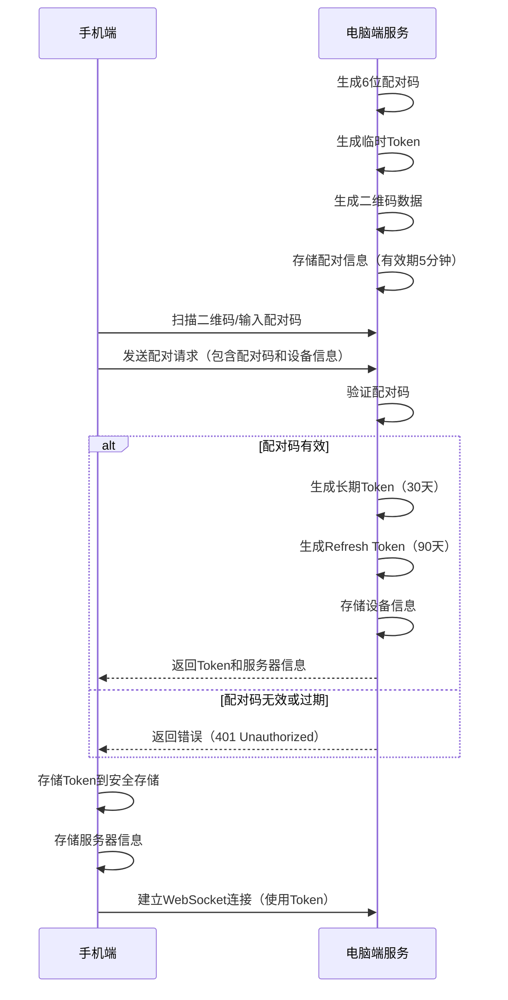
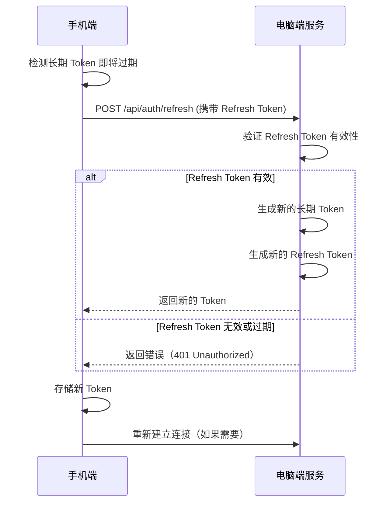
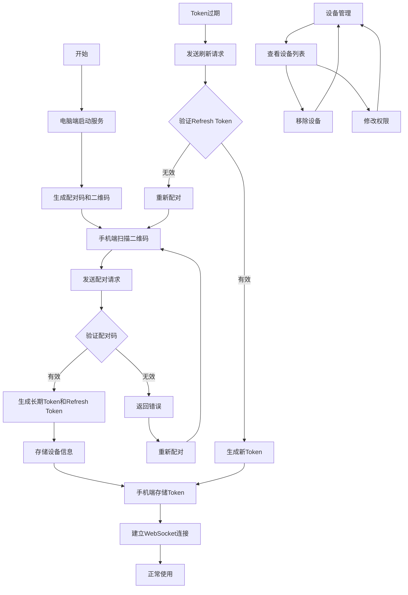

# 认证与配对流程

## 1. 概述

Trae 手机端与电脑端之间采用基于 JWT 的认证机制，通过设备配对流程建立安全连接。本文档详细描述了认证流程、令牌管理和安全措施。

## 2. 设备配对流程

### 2.1 配对前准备

1. **电脑端启动服务**
   - 启动 Trae 服务，监听指定端口
   - 生成配对配置（端口、加密设置等）

2. **手机端准备**
   - 安装 Trae 手机端应用
   - 打开应用，进入配对界面

### 2.2 配对流程



### 2.3 详细步骤说明

1. **步骤 1: 电脑端生成配对信息**
   - 生成 6 位数字配对码（有效期 5 分钟）
   - 生成临时 JWT Token（有效期 5 分钟）
   - 生成二维码，包含以下信息：
     - 服务器地址（IP:端口）
     - 配对码
     - 临时 Token
   - 在内存中存储配对信息，关联配对码和临时 Token

2. **步骤 2: 手机端扫描二维码**
   - 打开 Trae 手机端应用
   - 点击 "配对新设备" 按钮
   - 使用摄像头扫描电脑端显示的二维码
   - 解析二维码数据，获取服务器地址、配对码和临时 Token
   - 发送配对请求到服务器

3. **步骤 3: 电脑端验证**
   - 接收配对请求
   - 验证配对码是否有效且未过期
   - 验证临时 Token 是否有效
   - 生成长期 JWT Token（有效期 30 天）
   - 生成 Refresh Token（有效期 90 天）
   - 存储设备信息（设备ID、名称、平台、版本）
   - 返回长期 Token、Refresh Token 和服务器信息

4. **步骤 4: 手机端存储凭证**
   - 接收服务器返回的 Token 和信息
   - 将 Token 存储到系统安全存储（Keychain/iOS 或 Keystore/Android）
   - 存储服务器信息（地址、端口、是否使用 SSL）
   - 使用长期 Token 建立 WebSocket 连接
   - 进入主界面，完成配对

## 3. 认证机制

### 3.1 Token 类型

| Token 类型 | 有效期 | 用途 |
|-----------|--------|------|
| 临时 Token | 5分钟 | 仅用于配对流程 |
| 长期 Token | 30天 | 日常认证，WebSocket 连接和 API 请求 |
| Refresh Token | 90天 | 用于刷新过期的长期 Token |

### 3.2 Token 结构

JWT Token 包含以下信息：

```json
{
  "sub": "device-uuid",      // 设备唯一标识
  "iat": 1698123456,         // 签发时间
  "exp": 1729659456,         // 过期时间
  "permissions": 2,          // 权限级别
  "deviceName": "手机设备",  // 设备名称
  "devicePlatform": "iOS"    // 设备平台
}
```

### 3.3 Token 验证

1. **WebSocket 连接验证**
   - 通过 URL 参数 `token` 传递 JWT Token
   - 服务端验证 Token 有效性
   - 验证失败时关闭连接

2. **API 请求验证**
   - 通过 HTTP Header `Authorization: Bearer {token}` 传递
   - 服务端验证 Token 有效性
   - 验证失败时返回 401 错误

## 4. Token 刷新流程



### 4.1 刷新策略

- **主动刷新**：当长期 Token 剩余有效期少于 7 天时，主动触发刷新
- **被动刷新**：当 API 请求或 WebSocket 连接因 Token 过期失败时，触发刷新
- **失败处理**：如果 Refresh Token 也过期，需要重新配对

## 5. 多设备管理

### 5.1 设备列表

电脑端维护已配对设备列表，包含以下信息：

- 设备 ID
- 设备名称
- 设备平台
- 最后活跃时间
- 权限级别
- Token 过期时间

### 5.2 设备管理操作

1. **查看设备列表**：电脑端可查看所有已配对设备
2. **移除设备**：电脑端可移除不再信任的设备
3. **修改权限**：电脑端可调整设备的权限级别
4. **批量操作**：支持批量移除或修改设备

## 6. 权限级别

| 权限级别 | 描述 | 可执行操作 |
|----------|------|------------|
| READ_ONLY (1) | 只读权限 | 文件浏览、终端查看、任务查看 |
| STANDARD (2) | 标准权限 | 执行普通命令、AI 对话、创建任务 |
| PRIVILEGED (3) | 特权权限 | 执行敏感命令、系统操作、管理设备 |

### 6.1 权限检查

- **服务端**：所有操作前检查设备权限级别
- **客户端**：根据权限级别隐藏或禁用相应功能

## 7. 安全措施

### 7.1 传输安全

- **公网环境**：强制使用 WSS + HTTPS (TLS 1.3)
- **局域网**：默认使用 WS + HTTP，首次连接需用户确认
- **证书验证**：服务端使用自签名证书，首次连接需用户确认

### 7.2 存储安全

- **Token 存储**：使用系统安全存储（Keychain/iOS 或 Keystore/Android）
- **敏感信息**：不在本地存储敏感信息
- **缓存清理**：登出时清除所有缓存和凭证

### 7.3 操作安全

- **敏感命令**：执行敏感命令时需要二次确认
- **权限分离**：根据设备权限级别限制操作
- **审计日志**：记录所有敏感操作

### 7.4 防滥用措施

- **速率限制**：限制 API 请求频率
- **连接限制**：限制单个设备的并发连接数
- **异常检测**：检测并阻止异常操作

## 8. 常见问题处理

### 8.1 配对失败

- **原因**：配对码过期、网络连接问题、服务器未运行
- **解决**：重新生成配对码、检查网络连接、确保服务器正常运行

### 8.2 Token 过期

- **原因**：长期 Token 过期且 Refresh Token 也过期
- **解决**：重新进行设备配对

### 8.3 连接断开

- **原因**：网络不稳定、服务器重启、Token 无效
- **解决**：检查网络连接、重新连接、验证 Token 有效性

### 8.4 设备被移除

- **原因**：电脑端移除了设备、权限被撤销
- **解决**：重新进行设备配对

## 9. 最佳实践

1. **定期更新**：保持手机端和电脑端应用更新到最新版本
2. **安全网络**：在安全的网络环境中进行配对和使用
3. **强密码**：电脑端服务可设置访问密码（可选）
4. **定期检查**：定期检查已配对设备列表，移除不再使用的设备
5. **权限最小化**：根据设备用途设置适当的权限级别

## 10. 流程图

### 10.1 完整认证流程

