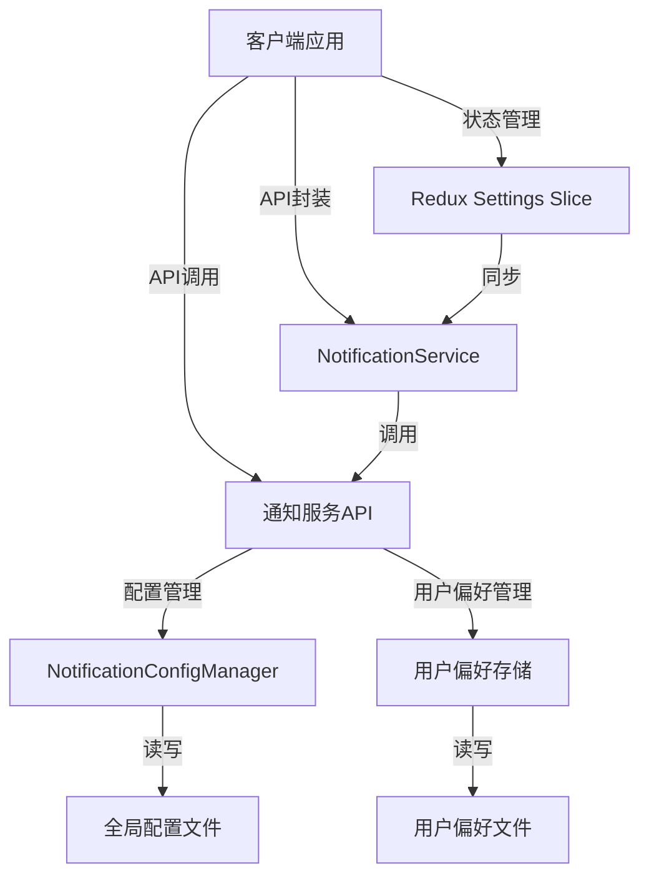

# 通知系统设计文档

## 1. 系统架构

### 1.1 架构概览

通知系统采用前后端分离架构，包含以下核心组件：

- **客户端**：React Native 应用，负责用户界面展示和通知设置管理
- **服务端**：Express.js 服务，提供通知配置管理和REST API
- **存储**：JSON文件存储（当前），计划迁移到Redis或SQLite
- **共享类型**：TypeScript类型定义，确保前后端类型一致性

### 1.2 组件关系



## 2. 核心功能

### 2.1 服务端配置管理

**NotificationConfigManager** 负责管理全局通知配置，提供以下功能：

- 默认配置生成
- 配置文件加载与保存
- 配置更新与合并
- 通知发送判断逻辑
- 通道获取
- 监听器模式（配置变更通知）

### 2.2 REST API

服务端提供以下API端点：

| 端点 | 方法 | 功能 | 请求体 | 响应 |
|------|------|------|--------|------|
| `/api/notification/config` | GET | 获取全局配置 | N/A | `{"general": {...}, "channels": {...}, "types": {...}}` |
| `/api/notification/config` | PUT | 更新全局配置 | `Partial<NotificationConfig>` | `{"success": true, "config": {...}}` |
| `/api/notification/user-preferences` | GET | 获取用户偏好 | N/A（需要x-device-id头） | `{"deviceId": "...", "preferences": {...}, "lastUpdated": 1234567890}` |
| `/api/notification/user-preferences` | PUT | 更新用户偏好 | `{"preferences": {...}}`（需要x-device-id头） | `{"success": true, "preferences": {...}}` |

### 2.3 客户端服务

**NotificationService** 封装了与服务端的通信，提供以下方法：

- `getNotificationConfig()` - 获取全局配置
- `updateNotificationConfig(config)` - 更新全局配置
- `getUserPreferences()` - 获取用户偏好
- `updateUserPreferences(preferences)` - 更新用户偏好
- `syncNotificationSettings(settings)` - 同步客户端设置到服务端

### 2.4 状态管理

客户端使用Redux Toolkit管理通知设置状态，主要包括：

- 通知总开关
- 各类型通知开关（mention、error、system等）
- 通知同步状态

## 3. 数据结构

### 3.1 共享类型定义

**NotificationType**：通知类型枚举
- `MENTION` - 提及通知
- `ERROR` - 错误通知
- `SYSTEM` - 系统通知
- `INFO` - 信息通知
- `SUCCESS` - 成功通知
- `WARNING` - 警告通知
- `FILE_CHANGE` - 文件变更通知
- `TASK_COMPLETED` - 任务完成通知
- `TASK_FAILED` - 任务失败通知
- `TERMINAL_OUTPUT` - 终端输出通知

**NotificationChannel**：通知通道
- `default` - 默认通道
- `important` - 重要通道
- `silent` - 静默通道

**NotificationConfig**：全局配置结构
```typescript
interface NotificationConfig {
  general: {
    enabled: boolean;
    maxNotifications: number;
    expirationTime: number;
  };
  channels: {
    default: {
      enabled: boolean;
      sound: boolean;
      vibration: boolean;
    };
    important: {
      enabled: boolean;
      sound: boolean;
      vibration: boolean;
    };
    silent: {
      enabled: boolean;
      sound: boolean;
      vibration: boolean;
    };
  };
  types: {
    [key in NotificationType]: {
      enabled: boolean;
      channel: NotificationChannel;
    };
  };
}
```

**UserNotificationPreferences**：用户偏好结构
```typescript
interface UserNotificationPreferences {
  deviceId: string;
  preferences: Partial<Record<NotificationType, boolean>>;
  lastUpdated: number;
}
```

## 4. 配置合并策略

### 4.1 优先级规则

当用户偏好、全局配置、类型默认值三者并存时，优先级为：

1. **用户偏好** > 2. **类型配置** > 3. **全局配置**

### 4.2 发送判断逻辑

`shouldSendNotification` 方法的判断逻辑：

1. 检查全局开关是否开启
2. 检查用户偏好是否启用该类型
3. 检查类型配置是否启用
4. 检查通道是否启用

## 5. 存储方案

### 5.1 当前实现

- **全局配置**：存储在 `server/storage/notification-config.json`
- **用户偏好**：存储在 `server/storage/user-notification-preferences.json`，以设备ID为键

### 5.2 改进计划

计划将用户偏好从JSON文件迁移到Redis或SQLite：

- **Redis**：使用哈希表存储，键为 `notification:user:{deviceId}`
- **SQLite**：创建 `user_notification_preferences` 表，包含 deviceId、preferences、lastUpdated 字段

## 6. 错误处理

### 6.1 服务端错误

| 错误码 | 描述 | HTTP状态码 |
|--------|------|------------|
| 400 | 无效的请求数据 | 400 |
| 400 | 缺少设备ID | 400 |
| 400 | 缺少偏好数据 | 400 |
| 500 | 配置加载失败 | 500 |
| 500 | 配置保存失败 | 500 |

### 6.2 客户端错误

客户端错误处理策略：

- 网络错误：显示网络连接失败提示
- 业务错误：根据错误码显示相应提示
- 未知错误：显示通用错误提示

## 7. 测试策略

### 7.1 服务端测试

- **单元测试**：测试 NotificationConfigManager 的核心方法
- **集成测试**：测试 API 端点的完整流程
- **异常测试**：测试错误处理和边界情况

### 7.2 客户端测试

- **Redux测试**：测试 settingsSlice 的 reducers 和 actions
- **服务测试**：测试 NotificationService 的 API 调用
- **组件测试**：测试 SettingsScreen 的 UI 交互

## 8. 部署与集成

### 8.1 依赖项

- **服务端**：Express.js、TypeScript、Redis/SQLite
- **客户端**：React Native、Redux Toolkit、Axios

### 8.2 集成点

- **WebSocket**：配置变更时通过 WebSocket 推送给客户端
- **认证**：使用 JWT 令牌进行 API 访问控制
- **设备管理**：与设备管理系统集成，获取设备信息

## 9. 性能考虑

- **缓存策略**：全局配置缓存，减少文件读写
- **并发控制**：使用锁机制或原子操作确保配置一致性
- **批量操作**：支持批量更新用户偏好

## 10. 安全考虑

- **权限控制**：全局配置更新需要管理员权限
- **数据验证**：所有输入数据需要严格验证
- **敏感信息**：避免在通知中包含敏感信息

## 11. 未来扩展

- **多语言支持**：通知内容的多语言翻译
- **通知模板**：支持自定义通知模板
- **高级过滤**：基于用户角色和上下文的通知过滤
- **分析统计**：通知发送和点击统计

## 12. 版本历史

| 版本 | 日期 | 变更内容 |
|------|------|----------|
| 1.0 | 2026-03-29 | 初始版本，包含基本通知功能 |
| 1.1 | 2026-04-01 | 添加集成测试，改进错误处理 |
| 1.2 | 2026-04-15 | 迁移到Redis存储，添加配置校验 |

## 13. 使用示例

### 13.1 服务端示例

```typescript
// 初始化配置管理器
const configManager = new NotificationConfigManager();

// 检查是否应该发送通知
const shouldSend = configManager.shouldSendNotification(
  NotificationType.MENTION,
  { mention: true }, // 用户偏好
  'user123' // 用户ID
);

// 更新配置
configManager.updateConfig({
  general: {
    enabled: true
  }
});
```

### 13.2 客户端示例

```typescript
// 初始化通知服务
const notificationService = new NotificationService();

// 同步通知设置
await notificationService.syncNotificationSettings({
  enabled: true,
  mention: true,
  error: false,
  system: true
});

// 获取全局配置
const config = await notificationService.getNotificationConfig();
```

## 14. 故障排除

### 14.1 常见问题

| 问题 | 原因 | 解决方案 |
|------|------|----------|
| 配置文件不存在 | 首次启动或文件被删除 | 系统会自动创建默认配置 |
| 配置文件损坏 | 文件写入失败或格式错误 | 系统会使用默认配置并重新保存 |
| 用户偏好未同步 | 网络连接失败 | 重试机制，或在网络恢复后自动同步 |
| API调用失败 | 认证失败或权限不足 | 检查令牌有效性和权限设置 |

### 14.2 日志与监控

- 服务端配置操作日志
- API调用日志
- 错误统计与告警

## 15. 结论

通知系统设计遵循关注点分离、类型安全、配置与用户偏好分离的原则，架构清晰，功能完整。通过迁移到更可靠的存储方案、增加输入校验、统一错误处理等改进，可以进一步提升系统的可靠性和可维护性。